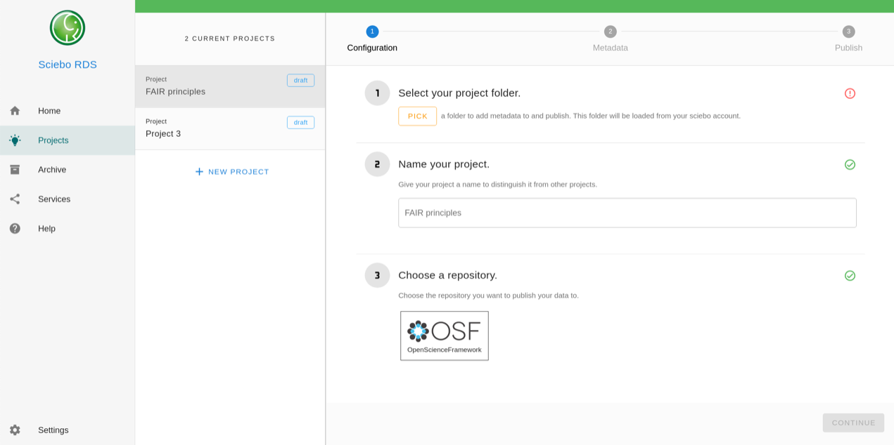

# Sciebo Research Data Services

Sciebo RDS allows researchers to export research data directly from Enterprise Sync and Share (EFSS) Systems like Owncloud to Data Repositories like Zenodo and OSF. It acts as a interoperability layer, allowing them to assign a directory on a Sync and Share System to a research project, annotating the contained data to match the format required by the desired Data Repository and publishing the Research Data directly from the Cloud. No need to download all the data to a desktop computer to cumbersomely upload it to the repository interface again.

Sciebo RDS is developed at the [University of Münster](http://uni-muenster.de), funded by the German Research Foundation and part of the CS3MESH4EOSC community, which strives to connect Research Cloud Storages in order to practice the so called [FAIR](https://www.nature.com/articles/sdata201618) principles.

Development of Sciebo RDS began in late 2019.

Sciebo RDS runs on a Kubernetes cluster. To learn more about the requirements and how to deploy your own Sciebo RDS instance, have a look at our [Getting Started](../gettingstarted/) guide or dive into the deep end by [developing a connector](../documentation/development/contributing/developing-connectors.md) for your favorite Data Respository or processing Software.

